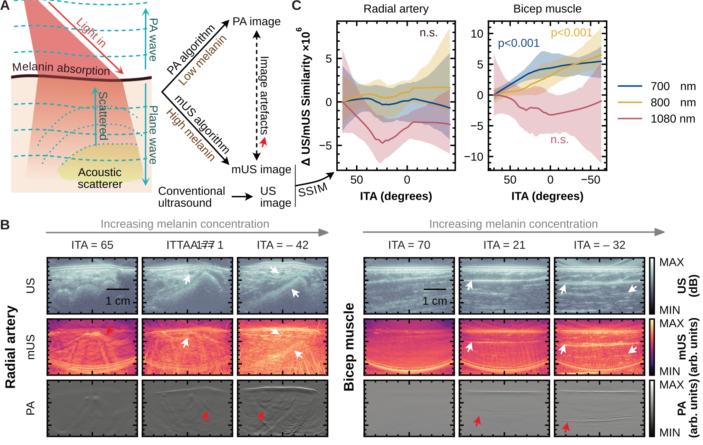

# Code for: "The confounding effects of skin colour in photoacoustic imaging"

### [Paper](https://www.medrxiv.org/content/10.1101/2025.03.28.25324605v1) | Dataset

**Authors:** [Thomas R. Else](https://github.com/tomelse), Christine Loreno, Alice Groves, Benjamin T. Cox, Evangelia Vetsiou, Janek Grohl, Ines Modellel, Sarah E. Bohndiek, Amit Roshan. *University of Cambridge*

Contact details: Sarah E. Bohndiek, seb53@cam.ac.uk; Amit Roshan, amit.roshan@cruk.cam.ac.uk.


*Figure 6 from the paper, showing the process of melanin absorption ultrasound reconstruction.*

Ths repository contains the code used for the paper "The confounding effects of skin colour in photoacoustic imaging". Figure papers can be reproduced using this code. The entire imaging dataset will be provided on Zenodo upon acceptance.

Note also: large files, such as the forward model matrix used for image reconstruction and in PA to US code can be found in the data deposit.

## Setting up the Python environment

This code relies extensively on the Python package PATATO [https://patato.rtfd.io/](https://patato.rtfd.io/). To setup a Python environment, I would recommend using something like Anaconda or [https://docs.astral.sh/uv/](uv). The deposited version of the code was tested on Windows with Python 3.12.9, but it should work on earlier versions of Python and on Mac and Linux.

```bash
git clone https://github.com/BohndiekLab/PAISKINTONE.git
cd PAISKINTONE
uv init . # (Or conda equivalent)
```

Details of the Python environment used in testing are given in `pyproject.toml`.

## Code description

The following directories are described in a rough order of how they should be run.

To setup the analysis with Data stored in a custom folder, edit data_paths.json. The default options are listed in this folder.

1. Directory "PAISKINTONETools":

Some utility functions for the analysis (e.g. statistical functions and matplotlib setup scripts). Should be installed using `cd "PAISKINTONETools"; pip install -e .` or equivalent to enable them to be used across the analysis scripts described below.

2. Directory "Prepare Data":

The key script in this folder is `generate_scan_tables.ipynb`. This script takes averages across regions of interest for all scans and outputs a convenient table for further analysis (`tables/pa_values_extracted.parquet`).

This directory contains several scripts to pre-process the data files. Common spelling errors in the raw data are corrected (`cleanupscannames.ipynb`). ITA values are imported from their raw format (`import_ita.ipynb`). Fitzpatrick type data is merged with other subject data (`add_fp_data.ipynb`).

3. Directory "Analysis":

This directory contains seveal scripts required to reproduce most of the figures in the paper. Each Jupyter notebook, labelled `figure1.ipynb` etc. will produce the corresponding figure (and possibly related supplementary figures).

4. Directory "Cleaned Pulse Ox":

A series of CSV files containing the imported, raw pulse oximetry values for each subject. These are summarised into one parquet file `so2_ita_pulseox_all.parquet` by the script `data_clean.ipynb`.

5. Directory "ColourimeterData":

Raw colourimeter data files for each subject (text file).

6. Directory "Data":

All photoacoustic imaging data files should be provided here, with a folder for each subject (SKIN01, for example), in which each scan is provided as a numbered HDF5 file (`Scan_1.hdf5`, for example). Due to storage constraints, example datasets are provided in a separate repository and the full raw data can be requested from the authors.

7. Directory "Fluence Correction":

All code required to run the simulations associated with the fluence correction algorithm described in the associated paper. The simulations make use of the Python package `pmcx`.

8. Directory "Phantoms":

All code required to analyse the phantom measurements made during this study, and to reproduce the figures for phantom analysis.

9. Directory "Scripts":

Custom scripts used for importation of raw data (selecting the slice with the minimal motion between runs) and for image reconstruction (custom model-based reconstruction).

10. Directory "SummaryTables":

Key anonymised demographic data used in the analysis scripts.

11. Directory "US from PA":

Scripts required to reconstruct plane-wave ultrasound images from photoacoustic scans with strong absorption by melanin in the epidermis. Code is also provided to reproduce the paper figures, and to run simple simulations.

13. Directory "Vitiligo":

Code required to analyse data and reprouce figure from the Vitiligo cohort of this study.
